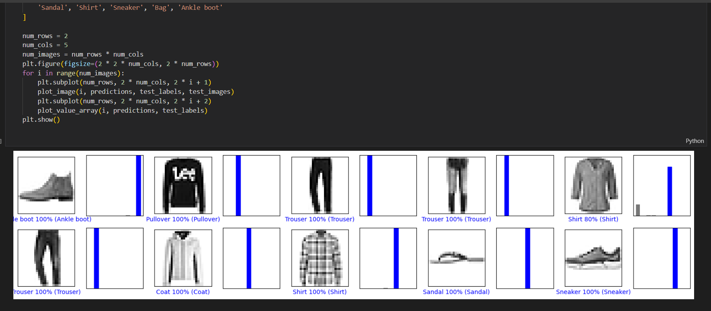

# Vogue Insight: The Multi-Class Classification Predictor


#### Last Updated: August 16th, 2023

## Table of Contents

1. [Introduction](#introduction)
2. [Installation](#installation)
3. [License](#license)


<a name="introduction"></a>
## Introduction
This project merges the realms of fashion and technology. Utilising the fascinating world of the MNIST fashion dataset, I built a multi-class classification neural network to train on thousands of 28x28 images of fashion items to predict the class of the item with the utmost accuracy.

<a name="installation"></a>
## Installation

Follow these steps to set up the environment and run the application:

1. Clone the Repository:
   
```bash
git clone https://github.com/Sambonic/vogue_insight
```

```bash
cd vogue_insight
```

2. Create a Python Virtual Environment:
```bash
python -m venv env
```

3. Activate the Virtual Environment:
- On Windows:
  ```
  env\Scripts\activate
  ```

- On macOS and Linux:
  ```
  source env/bin/activate
  ```

4. Install Dependencies:

```bash
pip install -r requirements.txt
```

<a name="license"></a>
## License

The MIT License (MIT)

This project is licensed under the MIT License - see the [LICENSE.md](Uber/LICENSE) file for details.

Permission is hereby granted, free of charge, to any person obtaining a copy of this software and associated documentation files (the "Software"), to deal in the Software without restriction, including without limitation the rights to use, copy, modify, merge, publish, distribute, sublicense, and/or sell copies of the Software, and to permit persons to whom the Software is furnished to do so, subject to the following conditions:

The above copyright notice and this permission notice shall be included in all copies or substantial portions of the Software.

THE SOFTWARE IS PROVIDED "AS IS," WITHOUT WARRANTY OF ANY KIND, EXPRESS OR IMPLIED, INCLUDING BUT NOT LIMITED TO THE WARRANTIES OF MERCHANTABILITY, FITNESS FOR A PARTICULAR PURPOSE, AND NONINFRINGEMENT. IN NO EVENT SHALL THE AUTHORS OR COPYRIGHT HOLDERS BE LIABLE FOR ANY CLAIM, DAMAGES, OR OTHER LIABILITY, WHETHER IN AN ACTION OF CONTRACT, TORT, OR OTHERWISE, ARISING FROM, OUT OF, OR IN CONNECTION WITH THE SOFTWARE OR THE USE OR OTHER DEALINGS IN THE SOFTWARE.

